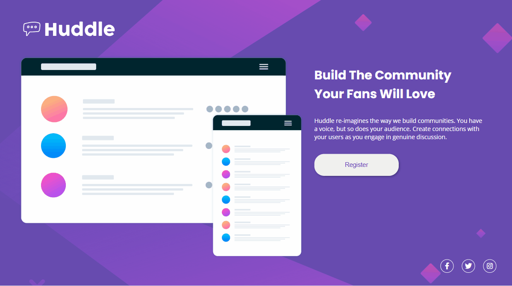

# Huddle Landing Page - Prática de HTML e CSS

Este repositório contém o projeto **Huddle Landing Page**, desenvolvido como parte do curso no DevQuest e baseado em um desafio do Frontend Mentor. O objetivo principal foi aplicar conhecimentos de HTML, CSS e responsividade, utilizando conceitos de **Flexbox**.

## Objetivo

Este projeto foi criado para consolidar os conhecimentos adquiridos no curso, incluindo:
- Estruturação de páginas com HTML semântico.
- Estilização avançada com CSS.
- Adaptação do layout para diferentes dispositivos usando media queries.

## Exemplo do Projeto

Abaixo estão prévias de como o projeto se apresenta em diferentes dispositivos:

### Versão Desktop


### Versão Mobile


### Aqui está um vídeo mostrando o funcionamento do projeto:  
[]

## Tecnologias Utilizadas

- **HTML5**
- **CSS3**
  - Flexbox
  - Media Queries para responsividade
- **Google Fonts**
  - Poppins
  - Open Sans
- **Font Awesome** para ícones das redes sociais

## Estrutura do Layout

- **Header**: Inclui o logo da página.
- **Main Section**: Composta por:
  - Uma imagem ilustrativa.
  - Texto promocional e descritivo.
  - Um botão de registro.
- **Footer**: Contém links para redes sociais.

## Estrutura do Projeto

- `index.html`: Arquivo principal com a estrutura da página.
- `src/css/reset.css`: Reset CSS para padronizar os estilos.
- `src/css/estilos.css`: Estilos principais da página.
- `src/css/responsivo.css`: Estilos específicos para dispositivos menores.

## Responsividade

O projeto foi desenvolvido inicialmente para a versão desktop, com ajustes para dispositivos menores utilizando **media queries**. Algumas adaptações incluem:
- Alteração do background e realocação dos elementos principais.
- Ajuste das fontes e tamanhos dos botões.
- Realinhamento do footer para centralizar os ícones de redes sociais.

## Como Visualizar o Projeto

1. Clone este repositório:
   ```bash
   git clone https://github.com/andreia-tofoli/projeto-huddle.git
